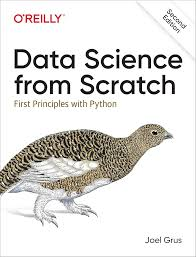

# Build K-nearst Model
---
## Overview
---
This project aims to predict weather based on their variabels using a K-nearst  model.

---
## Objectives
---
* Perform data scaling  
* Conduct Exploratory Data Analysis (EDA)  
* Build a Linear Regression model  
* Provide insights based on the results  

---
## Dataset
---
The dataset contains 1 feature and 1 target variable:
* temp_c 
* dew_point_temp_c
* rel_hum_%
* wind_speed_km/h
* visibility_km
* press_kpa
* time
* months
* year
* weathers (target)

---
## Structure Folder
---
```bash
Drugs
│
├── scratch
├── main.ipynb
├── Weather Dataset.csv 
└── README.md
```

---
## Tech Stack
---
* Python  
* Pandas  
* NumPy  
* Matplotlib  
* Scratch implementation (manual modeling)

---
## Workflow
---
* Data Cleaning  
* Exploratory Data Analysis (EDA)  
* Build Model  
* Test Model  
* Conclusion  

---
## Model Evaluation
---

| Variables | Model 1 | Model 2 |
|-----------|---------|---------|
| accuracy  | 0.64    | 0.58    |


---
# Reference
---
Book  



---
## Author
---
Syukri Fajrin  
GitHub: https://github.com/syukriFajrin  
LinkedIn: https://www.linkedin.com/in/syukri-fajrin-0800aa342  
